# <center>华中科技大学计算机科学与技术学院</center>  <center>计算机组成原理实验报告</center>  <center>MIPS指令集单总线处理器设计</center>  
<center>计科校交 1801</center>  <center>车春池</center>  <center>U201816030</center>  <center>E-mail:1276675421@qq.com</center>  <center>指导老师：胡迪青</center>

## 定长指令周期 3 级时序
### 设计要求
本实验要求理解定长指令周期三级时序系统的设计，能利用该时序构造硬布线控制器，支持 5 条典型 MIPS 指令在单总线 CPU 上运行，最终 CPU 能运行内存冒泡排序。  

### 方案设计
#### MIPS 指令译码器设计
利用比较器将 32 位 MIPS 指令字译码生成相应的指令译码信号。  
结合 MIPS 指令手册，分析指令对应的字段的关系，如下图连接电路：  
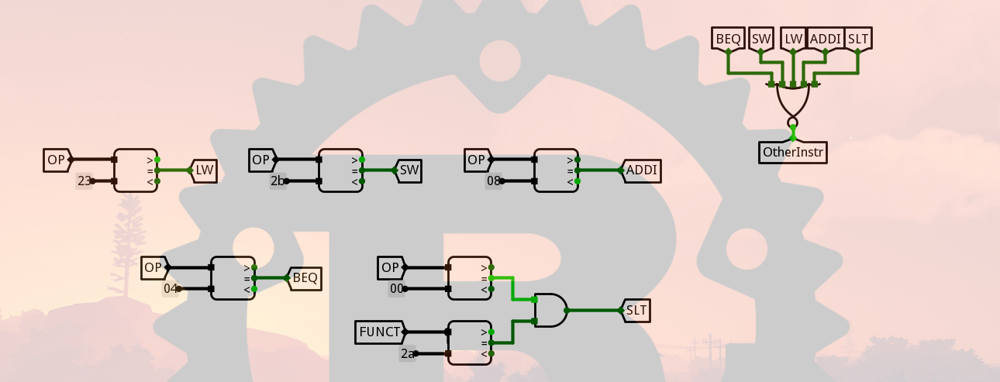  

#### 定长指令周期时序发生器设计
按照状态图填写相应的 excel 表格，自动生成次态逻辑表达式，然后在 logisim 中自动生成电路。  
由于这里的逻辑比较简单，因此直接在 logisim 的电路分析功能里面填写真值表：  
  
然后自动生成电路即可。  

#### 定长指令周期时序发生器输出函数设计
输出函数为组合逻辑，输入为状态寄存器的现态输出，输出为状态周期电位和节拍电位信号。  
按照时序输出要求，填写 excel 表格，自动生成各输出信号的逻辑表达式，在 logisim 中自动生成电路。  
同上，这里直接在 logisim 的电路分析功能中填写真值表：  
  

#### 硬布线控制器组合逻辑单元设计
这里所有微操作信号都是反馈信号，指令译码信号，状态周期电位，节拍电位的组合逻辑表达式，如下式：  
$C_{n} = \sum_{m,i,k,j} (I_m * M_i * T_k * B_j)$  
列出所有微操作信号的产生条件，填写相应 excel 表格，自动生成逻辑表达式，然后在 logisim 中自动生成电路。  
填好的 excel 表格如下：  
  
然后根据表格第二页自动生成的微操作信号逻辑表达式在 logisim 的电路分析功能中自动生成电路。  

#### 定长指令周期硬布线控制器设计
在实现指令译码，时序发生器关键功能部件，硬布线控制器等功能模块后，最终实现硬布线控制器的集成，硬布线控制器的集成。  
在硬布线子电路中将时序状态机与输出函数，状态寄存器正确连接，实现时序发生器逻辑。  
根据原理图，电路连接如下：  
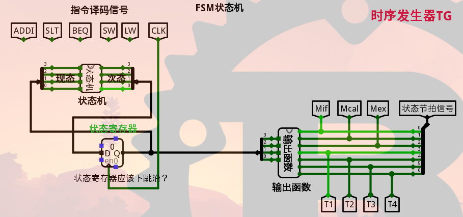  


#### 定长指令周期单总线 CPU 设计
在 RAM 中加载 sort-5.hex 程序，ctrl+k 自动运行，程序应该运行至 0xbbb 节拍停下，指令计数为 251，注意最后一条指令是 beq 分支指令，会跳回当前指令继续执行，是死循环。  
```asm
 .text
sort_init:
 addi $s0,$0,-1
 addi $s1,$0,0
 sw $s0,512($s1)
 addi $s0,$s0,1
 addi $s1,$s1,4
 sw $s0,512($s1)
 addi $s0,$s0,1
 addi $s1,$s1,4
 sw $s0,512($s1)
 addi $s0,$s0,1
 addi $s1,$s1,4
 sw $s0,512($s1)
 addi $s0,$s0,1
 addi $s1,$s1,4
 sw $s0,512($s1)
 addi $s0,$s0,1
 addi $s1,$s1,4
 sw $s0,512($s1)
 addi $s0,$s0,1
 addi $s1,$s1,4
 sw $s0,512($s1)
 addi $s0,$s0,1
 addi $s1,$s1,4
 sw $s0,512($s1)
 
 add $s0,$zero,0   
 addi $s1,$zero,28
sort_loop:
 lw $s3,512($s0)     
 lw $s4,512($s1)
 slt $t0,$s3,$s4
 beq $t0,$0,sort_next
 sw $s3, 512($s1)
 sw $s4, 512($s0)   
sort_next:
 addi $s1, $s1, -4   
 beq $s0, $s1,  sort_next1  
 beq $0,$0,sort_loop
sort_next1:
 addi $s0,$s0,4
 addi $s1,$zero,28
 beq $s0, $s1, ProgramEnd
 beq $0,$0,sort_loop
 ProgramEnd:beq $0,$0,ProgramEnd
```
### 实验步骤
#### MIPS 指令译码器设计
+ 分析指令字和译码信号的对应关系
+ 连接电路

#### 定长指令周期时序发生器设计
+ 分析状态图
+ 按照状态图填写相应的 excel 表格，自动生成次态逻辑表达式
+ 自动生成电路

#### 定长指令周期时序发生器输出函数设计
+ 分析时序输入与输出关系
+ 按照时序输出要求，填写 excel 表格，自动生成各输出信号的逻辑表达式
+ 自动生成电路

#### 硬布线控制器组合逻辑单元设计
+ 分析微操作信号的产生条件
+ 列出所有微操作信号的产生条件，填写相应 excel 表格，自动生成逻辑表达式
+ 自动生成电路

#### 定长指令周期硬布线控制器设计
+ 分析各模块功能和连接关系
+ 在硬布线子电路中将时序状态机与输出函数，状态寄存器正确连接

#### 定长指令周期单总线 CPU 设计
+ 在 RAM 中加载程序，运行

### 故障与调试
#### 故障一
在硬布线控制器组合逻辑单元设计关卡中，有一条 SLT 指令没有出现在 MOOC 和 PPT 上。一开始不知道这条指令的微操作信号如何组织和处理。  
解决办法：通过查阅 MIPS 指令手册和理解单总线 CPU 数据通路，自己思考一组 SLT 指令的微操作序列，并在表格中进行相应的填写。  

#### 故障二
在定长指令周期硬布线控制器设计关卡中，按照原理图连好并反复检查的电路，在 educoder 自动测试平台中一直测试不通过。  
解决办法：通过观察 educoder 控制台的测试输出和结合测试用例，最终检查出了是寄存器时钟沿设置错误的原因。将状态寄存器改为下降沿触发之后就成功地在 educoder 平台中测试通过了。  

### 测试与分析
最终在 educoder 平台中通过了所有关卡的测试：  
  
个别关卡在多次评测之后才正确通过。  
工作效率比较低，可能是因为我一边学习一边做实验的缘故。  

## 现代时序
### 设计要求
本实验要求理解定长指令现代时序系统的设计，能利用该时序构造微程序控制器，支持 5 条典型 MIPS 指令在单总线 CPU 上运行，最终 CPU 能运行内存冒泡排序。  
### 方案设计
#### MIPS 指令译码器设计
利用比较器将 32 位 MIPS 指令字译码生成相应的指令译码信号。  
结合 MIPS 指令手册，分析指令对应的字段的关系，如下图连接电路：  
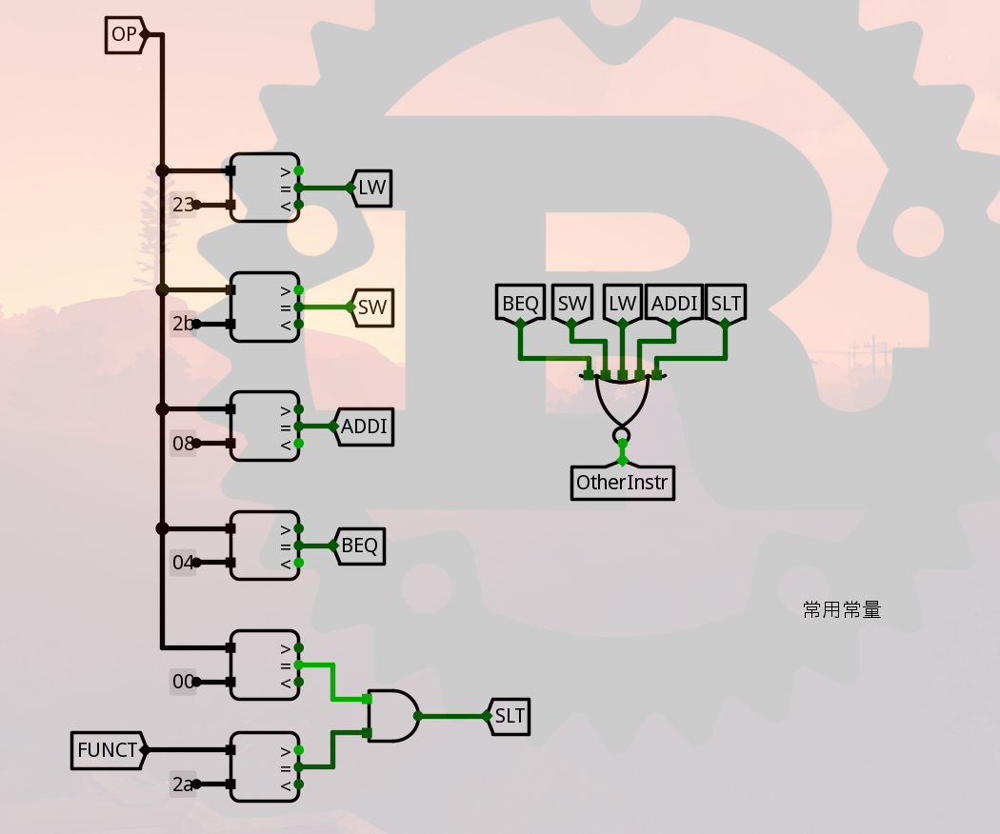  

#### 单总线 CPU 微程序入口查找逻辑
根据指令译码信号生成 5 位的微程序入口地址，组合逻辑。  
填写 excel 表格，表格自动生成逻辑表达式。  
不同指令对应不同的微程序入口逻辑，同时对应的入口地址也会随着设计的不同而改变，这里我选择和 MOOC 上讲的保持一致，自动生成后的电路图如下：  
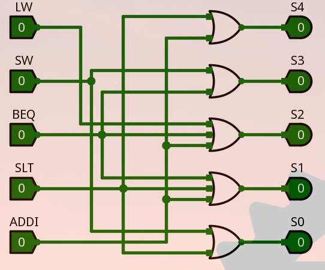  

#### 单总线 CPU 微程序条件判别测试逻辑
填写 excel 表格中的组合逻辑真值表，表格自动生成逻辑表达式，在 logisim 中利用分析组合逻辑电路功能自动生成电路。  
这里的逻辑比较简单，因此直接在 logisim 的电路分析功能中填写真值表，自动生成的电路如下：  
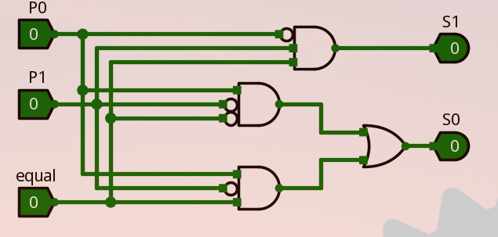  

#### 单总线 CPU 微程序控制器设计
将微程序入口查找逻辑，判别测试逻辑，控制存储器等部件进行适当连接，实现微程序控制器的主要数据通路，设计微程序并加载到控制存储器中。  
微程序设计可以通过填写 excel 文件中的微程序自动生成表自动生成。  
微程序自动生成表主要是结合每个微操作所需要的控制信号和是否需要跳转来填写，这是一个难度不大但工作量大的步骤，填写好的表格如下：  
  
将表格中自动生成的微程序复制到控制存储器元件中，然后进行微程序控制器的联调，如图：  
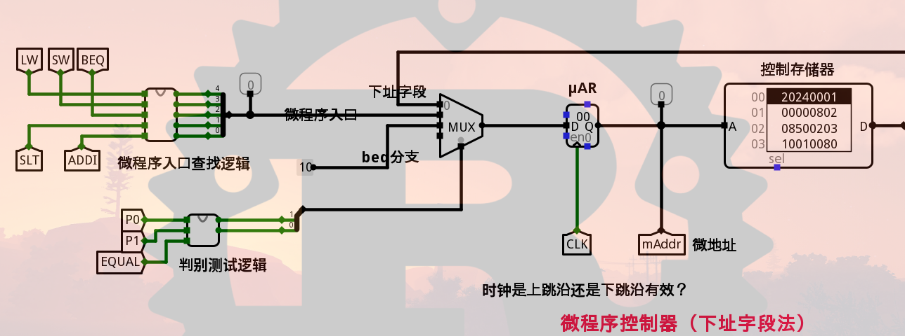  

#### 采用微程序的单总线 CPU 设计
在 RAM 中加载 sort-5.hex 程序，ctrl+k 自动运行，程序应该运行至 0x7c1 节拍停下。  

#### 现代时序硬布线控制器状态机设计
按状态图填写 excel 表格，自动生成次态逻辑表达式后，即可在 logisim 中自动生成该电路。  
分析每个状态和次态之间的的关系，填写表格如下：  
  
然后利用表格的另一页中自动生成的次态逻辑表达式在 logisim 中的电路分析功能中自动生成电路。  

#### 现代时序硬布线控制器设计
在实现指令译码，现代时序状态机模块后，最终实现硬布线控制器的集成，在实验框架中把相应模块正确连接起来就行了，注意硬布线控制器组合逻辑不需要实现直接采用微程序控制器的控制存储器代替即可。  
将微程序填入到控制存储器元件中，然后进行硬布线控制器的联调，如图：  
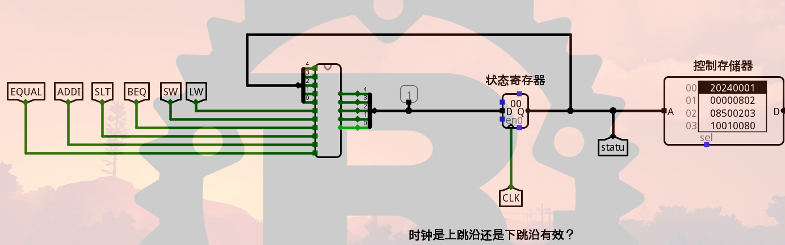  

### 实验步骤
#### MIPS 指令译码器设计
+ 分析指令字和译码信号的对应关系
+ 连接电路

#### 单总线 CPU 微程序入口查找逻辑
+ 分析微程序入口查找逻辑
+ 填表
+ 自动生成电路

#### 单总线 CPU 微程序条件判别测试逻辑
+ 分析微程序条件判别测试逻辑
+ 填写 excel 表格，表格自动生成逻辑表达式
+ 自动生成电路

#### 单总线 CPU 微程序控制器设计
+ 分析微程序控制器各模块部件之间关系
+ 连接电路
+ 填表生成微程序
+ 将微程序填入存储器中
+ 运行

#### 采用微程序的单总线 CPU 设计
+ 在 RAM 中加载程序，运行

#### 现代时序硬布线控制器状态机设计
+ 分析现代时序硬布线核心部件状态机
+ 按状态图填写 excel 表格，自动生成次态逻辑表达式
+ 自动生成电路

#### 现代时序硬布线控制器设计
+ 分析现代时序硬布线控制器各模块部件之间关系
+ 连接电路
+ 填表生成微程序
+ 将微程序填入存储器中
+ 运行

### 故障与调试
#### 故障一
在现代时序硬布线控制器设计关卡中，连接好电路并反复检查，在 educoder 中评测的时候一直不通过，测试结果一直为 x。  
解决办法：分析 educoder 测试结果，最终发现是我忘了在控制存储器中填入微程序的内容。修改错误之后，成功在 educoder 平台中测试通过。  

### 测试与分析
最终在 educoder 平台中通过了所有关卡的测试：  
  
在这次实验中，一次通过的关卡占 50%，比率增加的原因是我对实验原理更加熟悉了。  
同时这使得我的工作效率得到了提升。  

## 现代时序中断机制实现
### 设计要求
本实验需要在理解现代时序控制器中断机制的实现原理的前提下，为采用现代时序单总线结构的 MIPS CPU 增加中断处理机制，可实现多个外部按键中断事件的随机处理，本实验需要完成现代时序微程序控制器的基础上完成，需要增加硬件数据通路，增加中断返回指令 eret 的支持，需要中断服务程序配合。  

### 方案设计
#### MIPS 指令译码器设计
利用比较器将 32 位 MIPS 指令字译码生成相应的指令译码信号。  
结合 MIPS 指令手册，分析指令对应的字段的关系，如下图连接电路：  
  

#### 支持中断的微程序入口查找逻辑
填写 excel 表格中的微程序入口地址表格，自动生成逻辑表达式，在 logisim 中利用分析组合逻辑电路功能自动生成电路。  
添加中断之后，添加了一条 eret 指令，这条指令对应一个新的微程序入口地址，其他的指令不便，填写表格后生成的电路如下：  
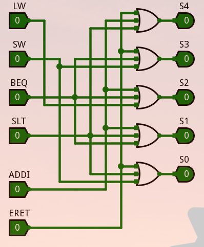  

#### 支持中断的微程序条件判别逻辑
填写 excel 表格中的组合逻辑真值表，自动生成逻辑表达式，在 logisim 中利用分析组合逻辑电路功能自动生成电路。  
这里直接在 logisim 中的电路分析功能中填写真值表，如下：  
  
其中有很多无关项，对于无关项不做处理。  

#### 支持中断的微程序控制器设计
将微程序入口查找逻辑，判别测试逻辑，控制存储器等部件进行适当连接，实现微程序控制器的主要数据通路，设计微程序并加载到控制存储器中。  
微程序设计可以通过填写 excel 文件中的微程序自动生成表自动生成。  
微程序设计和前面的差不多，支持中断的微程序设计主要是添加了 eret 指令和在公操作阶段判断是否存在中断而已，表格填写如下：  
  
将生成的微程序值填入到微程序控制器元件中，然后对其余元件进行联调：  
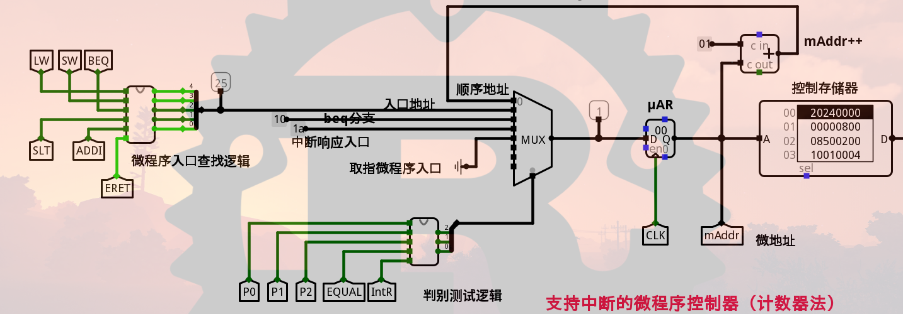  

#### 支持中断的微程序单总线 CPU 设计
完成前面所有关卡之后，在单总线数据通路中增加于中断相关的硬件模块，主要包括异常程序地址计数器 epc，中断使能寄存器 ie，中断控制等模块，需要在主电路中将这些模块进行有效连接，并在本关进行最终的联调，测试 CPU 是否能正常响应 2 个按键对应的中断服务程序。  
这部分需要处理的逻辑主要有：  
+ 使用 epc 寄存器保存断点
+ 开中断和关中断
+ 处理中断控制信号
+ 中断处理函数地址

连接电路如下：  
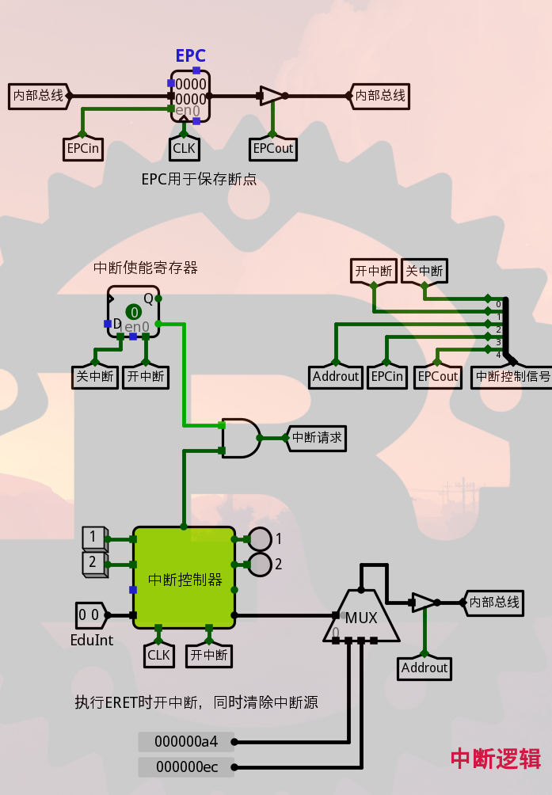  

#### 支持中断的现代时序硬布线控制器状态机设计
按照状态图，填写 excel 表，自动生成次态逻辑表达式后，即可在 logisim 中自动生成该电路。  
支持中断之后，对于 eret 之外的其他指令，需要在公操作部分判断是否有中断到来而选择相应的次态，增加这部分的判断逻辑即可。而对于 eret 指令，根据状态图分析现态和次态的关系再填表即可。  

#### 支持中断的现代时序硬布线控制器设计
在实现指令译码、现代时序状态机模块后，最终实现硬布线控制器的集成，硬布线控制器组合逻辑不需要实现直接采用微程序控制器的控制存储器代替即可，完成测试后用硬布线控制器替换cpu中的微程序控制器进行程序测试。  
将之前生成的微程序放入到控制存储器元件中，然后根据原理图进行其余元件的联调：  
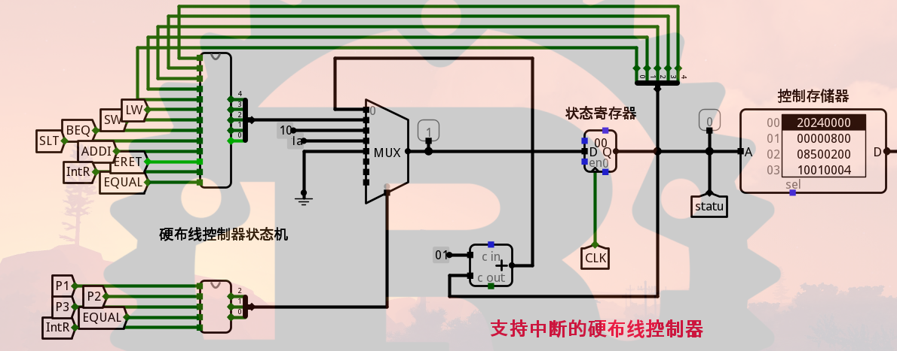  

### 实验步骤
#### MIPS 指令译码器设计
+ 分析指令字和译码信号的对应关系
+ 连接电路

#### 支持中断的微程序入口查找逻辑
+ 分析支持中断的微程序入口查找逻辑
+ 填写 excel 表格中的微程序入口地址表格，自动生成逻辑表达式
+ 自动生成电路

#### 支持中断的微程序条件判别逻辑
+ 分析支持中断的微程序条件判别测试逻辑
+ 填写 excel 表格中的组合逻辑真值表，自动生成逻辑表达式
+ 自动生成电路

#### 支持中断的微程序控制器设计
+ 分析支持中断的微程序控制器各模块部件之间关系
+ 连接电路
+ 填表生成微程序
+ 将微程序填入存储器中
+ 运行

#### 支持中断的微程序单总线 CPU 设计
+ 分析在单总线数据通路中增加与中断相关的硬件模块
+ 对增加的硬件模块进行联调
+ 运行

#### 支持中断的现代时序硬布线控制器状态机设计
+ 分析状态图，填写 excel 表格，自动生成次态逻辑表达式
+ 自动生成电路

#### 支持中断的现代时序硬布线控制器设计
+ 分析支持中断的现代时序硬布线控制器各模块部件之间关系
+ 连接电路
+ 填表生成微程序
+ 将微程序填入存储器中
+ 运行

### 故障与调试
### 故障一
一开始对于中断机制的实现不是很熟悉，因为缺少 MOOC 相关指导，也不是很清楚实验要干什么。  
解决办法：回头看相关的中断原理的 PPT 和其他资料，结合前面的两个实验，理解中断机制。  
### 故障二
在支持中断的微程序单总线 CPU 设计关卡，不是很清楚如何通过这个子电路对整个 CPU 产生影响。  
解决办法：结合之前的单总线 CPU 数据通路原理课程，明白了在这部分我需要做的就是通过中断控制信号和三态门来控制数据在总线上的流动，实现断点的保存和中断处理程序地址的转移。  

### 测试与分析
最终在 educoder 平台中通过了所有关卡的测试：  
  
这次实验的难度比较大，主要原因在于对中断机制的不熟悉和对实验框架的陌生，但实际上这个实验的工作量比前面两个要小，因为很多情况下我们只需要在前面的实验基础上做加法。  
这次实验的错误率进一步减少了。  
由于工作量不大，因此在难度较大的基础上工作效率和前面两个实验差别不大。  

## 实验总结
### 实验方案总结
三个 CPU 实验的实验方案基本上都是一样的：在理解原理的基础上通过填表 + 实现子模块的形式，一步步构建简单的 MIPS CPU。由于实验指导十分明确，实验基本上按照实验指导说的一步步走就可以了。  
本次组原实验通过 educoder 平台自动测试的形式，既减轻了课程老师的压力，同时也省去了我们学生搭建环境的功夫。我的亲身经历告诉我配置环境是一件十分痛苦的事情。  
但是 educoder 同时也有缺点，它使用的是黒箱测试，有些错误和 bug 在 educoder 平台上很难发现，尽管它提供了测试用例和错误输出。  

### 功能总结
本次实验实现了 3 个简单的 MIPS 指令集处理器。  
其中的两个实现的功能相同：  
+ 支持 5 条 MIPS 指令
+ 能运行一个简单的排序程序

但是性能和设计不同，分别是 3 级时序和现代时序，前者实现简单但性能低，后者相反。  
第三个 CPU 增加了中断机制，可以响应按键中断并进行简单的中断处理。但实际场景的中断机制远比我们实现的这个要复杂，因此本次实验只是让我们体验了一下中断而已，要想实现真正的中断还需要更深入的研究和尝试。  

### 实现心得
从进入华科计算机学院以来，这学期的组原实验是我体验最好的一个实验，具体表现在以下方面：  
+ 体验友好：实验采用 educoder 自动测试平台，既让老师从检查实验中解放出来，同时也让学生将精力集中到做实验本身，而不是配置环境等一些其他的东西。
+ 难度合理：实验难度恰到好处，清楚明白的实验指导让学生很容易知道自己该干什么，并且很快地将课上学到的知识融入到实验中去。
+ 设计正确：我曾经做过一写实验，这些实验本身有些原理或者目标就是错误的，或思想十分老旧或设计本身就有问题。但这次组原实验的设计十分严谨，有些无可奈何的地方老师也明确地声明这是为了方便实验而设计的。可以看出设计实验的老师水平较高。
+ 评测标准明确：我曾做过一些实验评测标准十分模糊，给同学们带来很大困扰，我们到底该怎么做才能得到高分？本次实验由 educoder 平台进行评测，只要所有关卡通关就能得到很好的分数。这让学生能全身心地投入到做实验本身而不是花大精力去思考怎么才能拿高分。  

本人尽管对于本实验已经足够满足，还是想提出以下建议：  
+ 增加指令集选择。MIPS 固然是很适合用来教学的指令集，但是多年来一直使用 MIPS 难免会落后于时代，况且目前 MIPS 基本上很少用于工业场景。这里推荐 RISC-V 指令集，这是一个同时适合做教学和实际应用的指令集，也是新兴的很值得期待的指令集，推广该指令集的教学对于未来的发展百利而无一害。
+ 减少填表的工作量和增加电路连接的工作量。在做本 CPU 实验的过程中，很大一部分时间都是在填表而不是在设计电路本身上。尽管填表的形式也能帮助我们融汇贯通课上学习的知识，但是写 CPU 总归是一项电路设计，我们希望是能把大部分工作时间放在 logisim 或者 fpga 等开发环境上。
+ 原理上增加和操作系统的协同工作。写 CPU 的目的一般都是为了跑操作系统，个人感觉本实验有点脱离操作系统而设计了，如果能增加一些和操作系统配合工作的环节就更好了。

## 参考文献
[1] DAVID A.PATTERSON(美).计算机组成与设计硬件/软件接口(原书第5版).北京:机械工业出版社.   
[2] David Money Harris(美).数字设计和计算机体系结构（第二版）. 机械工业出版社  
[3] 谭志虎,秦磊华,胡迪青.计算机组成原理实践教程.北京:清华大学出版社，2018年.  
[4] 秦磊华，吴非，莫正坤.计算机组成原理. 北京:清华大学出版社，2011年.  
[5] 袁春风编著. 计算机组成与系统结构. 北京:清华大学出版社，2011年.  
[6] 张晨曦，王志英. 计算机系统结构. 高等教育出版社，2008年.  

## 指导教师评定意见
### 原创性声明
本人郑重声明本报告内容，是由作者本人独立完成的。有关观点、方法、数据和文献等的引用已在文中指出。除文中已注明引用的内容外，本报告不包含任何其他个人或集体已经公开发表的作品成果，不存在剽窃、抄袭行为。 
特此声明！  
### 对课程实验的学术评语（教师填写）
  
  
  

### 对课程实验的评分（教师填写）
|评分项目|报告撰写|课设过程|最终评定|
|-------|------|-------|-------|
|||||